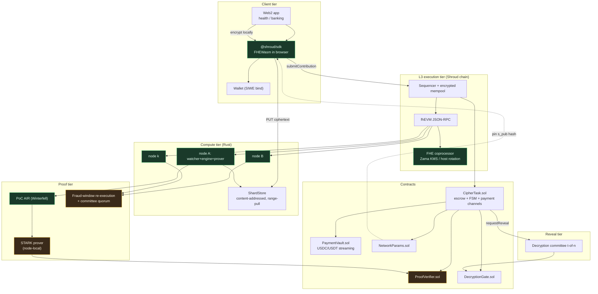
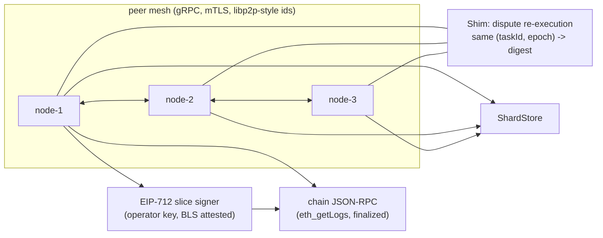

# Shroud — System Architecture (L3 AppChain on FHE)

> Status: MVP specification. Parameter targets are measured on the reference node; see
> `docs/05-honest-limitations.md` before quoting any throughput.

---

## 0. The one-paragraph version

A user encrypts their record **on their own device** under the Shroud network public
key and publishes only the ciphertext. A buyer escrows a budget on-chain in USDC and
publishes a model spec (IPFS). Any node can execute the buyer's training job over the
ciphertexts because the network public key is an **FHE key** — arithmetic on ciphertexts
yields ciphertexts. Nodes commit each epoch to a ZK proof of compute; on acceptance, escrow
streams out to data contributors and compute nodes. The buyer receives the trained weights,
decrypted via a **threshold decryption committee** whose key shares are released only after
settlement. Individual records are never decrypted by anyone.

---

## 1. Trust model (read this before anything else)

| Party | Trusted with | NOT trusted with |
|---|---|---|
| User | own plaintext, own private key | anything else |
| Web2 app integrating the SDK | nothing — SDK is client-side, plaintext never leaves the browser | — |
| Buyer | escrow budget, model spec | plaintext of any individual row |
| Compute node | the ciphertext set (already public on DA) | plaintext (it never has it), secret key |
| Decryption committee (t of n) | jointly, only the *output* ciphertexts | individual records |
| Sequencer | transaction ordering, cannot decrypt | plaintext |
| fhEVM coprocessor | ciphertext ops, FHE host rotation | plaintext |

**Critical invariant (INV-1):** plaintext rows are never submitted to any party other than
the user. The only thing that is ever revealed in the clear is the *model output*, and only
after `TaskSettled`.

**Critical invariant (INV-2):** the FHE secret key `s` is never reconstructed in memory by
any single process. It is a Shamir-shared polynomial `f(x)` of degree `t-1` split across
`n >= 3t-1` committee members. Decryption is a linear combination of partial decryptions,
so no single member — and no coalition of `t-1` members — can decrypt.

**Critical invariant (INV-3):** a compute node cannot profitably lie. Either its STARK
verifies (then the trace binds the actual ciphertext digests, the actual weight vector and
the actual gradient) or the task enters a fraud window in which other nodes re-execute and
a majority report triggers slashing. See `docs/03-proof-of-compute.md`.

---

## 2. Key hierarchy

```
                    ┌──────────────────────────────────────────────┐
   DKG (n=7, t=4)   │  Shroud Network FHE Keypair              │
   committee        │                                              │
                    │  s_pub  ── published at /v1/params/network   │
                    │  s      ── f(0), split as shares (i, f(i))    │
                    │            held by committee, never on chain │
                    └──────────────────────────────────────────────┘
                                     │ encrypts
              ┌──────────────────────┴───────────────────────┐
              ▼                                              ▼
    ┌───────────────────┐                        ┌────────────────────┐
    │ User record       │                        │ Buyer model spec   │
    │ ct = Enc(s_pub, r)│                        │ IPFS CID, 33-d     │
    │ published to DA   │                        │ + epochs, lr, λ    │
    └───────────────────┘                        └────────────────────┘
```

Derived keys:

- `s_pub` — FHE public key. Published in the DA-backed params bundle and pinned on chain via
  `NetworkParams` so a node can detect a key-swap attack (see §7).
- `committeePub` — BLS aggregate verification key. One BLS signature by the committee
  authorises an on-chain reveal request without a per-member transaction.
- `nodeId = keccak256(blsPubKey[0:20] ∥ operatorAddress)` — binding a node to its stake.

---

## 3. End-to-end flow

### 3.1 Mermaid: full sequence

```mermaid
sequenceDiagram
    autonumber
    participant U as User (Web2 app + SDK)
    participant DA as Data Availability<br/>(blob/IPFS)
    participant SEQ as Shroud Sequencer<br/>(encrypted mempool)
    participant L3 as fhEVM L3 Rollup
    participant C as CipherTask.sol
    participant CN1 as Rust Compute Node #1
    participant CN2..k as Compute Nodes #2..k
    participant DKG as Decryption Committee
    participant B as Buyer

    Note over U: plaintext stays in browser tab
    U->>U: 1. GET /v1/params/network → s_pub
    U->>U: 2. JSON → feature vector (33-d, scale to uint32) <br/> + Pedersen/Groth16 proof "I know a row with <shape>"
    U->>U: 3. Encrypt chunks with Zama FHEWasm (batched, N=8/ct)
    U->>DA: 4. PUT ciphertext bundle (content-addressed)
    U->>U: 5. bind data hash to wallet (EIP-712 typed data)
    U->>SEQ: 6. submitContribution{ciphertextCid, proof}
    SEQ->>L3: 7. tx → CipherTask.submitContribution
    L3->>C: 8. escrow ledger: contribution credited
    C-->>B: 9. TaskProgressChanged → new ciphertext root

    loop each epoch e = 0..E-1
        Note over B: weights_e = plaintext input only for buyer
        B->>C: 10. openEpoch(taskId, e, encWeightsCid, revealKeyShare)
        C->>L3: 11. encrypted-state checkpoint: encrypt(accumulated metric, noise budget, epoch ck)
        C-->>CN1,CN2: 12. EpochOpened event (via watcher)
        CN1->>DA: 13. GET encrypted shards (range pull)
        CN1->>DA: 13b. GET encWeightsCid
        CN1->>CN1: 14. TFHE: SIMD matmul + SGD step over ciphertexts<br/>(no decryption) → w_{e+1}
        CN1->>CN1: 15. Hash-chain trace over (ct digest, w digest, grad digest)
        CN1->>CN1: 16. ZK-STARK prove (Winterfell, ~2^20 trace)
        CN1->>DA: 17. PUT encWeights_{e+1} + proof + metrics
        CN1->>C: 18. commitEpoch{taskId, e, proof, encWeightsCid}
        C->>C: 19. verify(publicInputs = (chainId, task, e, ctRoot, wDigest, nodeId))
        alt proof valid
            C->>C: 20. settle slice to node; open payment channel
            C-->>CN2: 21. EpochCommitted → honest-bond state advanced
        else proof invalid / dispute
            C->>C: 22. flag fraud window, other nodes re-execute
            C->>C: 23. majority mismatch → slash + re-assign epoch
        end
    end

    Note over B,C: reveal only now
    B->>C: 24. requestReveal(taskId) (after settlement)
    C->>DKG: 25. on-chain request + BLS aggregate sig gating
    DKG->>DKG: 26. each member partial-decrypts OUTPUT ciphertexts only
    DKG->>L3: 27. submitPartialDecryption (compressed, ~32B/member/ct)
    C->>C: 28. combine ≥ t shares → plaintext w_E
    C->>B: 29. EncryptedDelivery/withdrawWeights
```

### 3.2 Mermaid: component map



### 3.3 ASCII fallback (for plain-text review / RFC 7230-style diffs)

```
 ┌──────────────┐   plaintext NEVER leaves the tab
 │  Web2 App    │   (browser -> FHEWasm -> ciphertext)
 │  (e.g. health│
 │   tracker)   │
 └──────┬───────┘
        │  @shroud/sdk
        ▼
 ┌─────────────────────────────────────────────────────────────┐
 │ CLIENT TIER                                                  │
 │  1 GET  /v1/params/network        -> s_pub, s_pub_hash       │
 │  2 shape 33-d feature vec, quantize to uint32 (scale 1e4)    │
 │  3 Groth16 prove: "I know a row with this shape & my address" │
 │  4 FHEWasm.encrypt(batch=8) -> 8 x ebytes64  (Bleve/PKES)    │
 │  5 PUT  da://shard/<sha256>       (content-addressed)        │
 │  6 EIP-712 bind(sha256(ciphertext) || taskId || address)      │
 └──────┬──────────────────────────────────────┬───────────────┘
        │ submitContribution                    │ ciphertext blobs
        ▼                                       ▼
 ┌───────────────────────┐        ┌──────────────────────────────┐
 │ Shroud L3 (fhEVM) │        │ DATA AVAILABILITY            │
 │  encrypted mempool    │        │  shard-0 ... shard-m         │
 │  sequencer -> RPC     │        │  ci = sha256(blob)           │
 └──────┬────────────────┘        └──────────┬───────────────────┘
        │ tx                                │ range pull
        ▼                                   │
 ┌──────────────────────────────────────────┴───────────────────┐
 │ fhEVM coprocessor  (FHE ops on-chain, key rotation per epoch) │
 └──────┬───────────────────────────────────────────────────────┘
        ▼
 ┌──────────────────────────────────────────────────────────────┐
 │ CipherTask.sol                                                │
 │  escrow USDC  │  FSM: OPEN→COLLECTING→EPOCH_OPEN→…→REVEAL    │
 │  euint32 liveEpoch  │  einput encState  │  proof commitments  │
 └──┬──────────────┬───────────────┬──────────────┬─────────────┘
    │ event log    │               │              │
    ▼              ▼               ▼              ▼
 ┌─────────┐ ┌────────────┐ ┌─────────────┐ ┌──────────────────┐
 │ watcher │ │ PaymentVault│ │ ZK verifier │ │ DecryptionGate   │
 │ (Rust)  │ │ micro-slice │ │  STARK      │ │ t-of-n BLS gate  │
 └────┬────┘ └────────────┘ └──────┬──────┘ └────────┬─────────┘
      │                             │ verified        │ settled
      ▼                             ▼                 ▼
 ┌────────────────────────────────────┐         ┌──────────────┐
 │ Rust Compute Node                  │         │ Committee     │
 │  ├ shard_store   (range pull)     │         │ partial-dec   │
 │  ├ fhe::engine   (TFHE, no dec.)  │         │ of OUTPUT ct  │
 │  ├ stark::circuit + prover        │         └──────┬───────┘
 │  └ payment::signer (EIP-712)      │                │
 └──────┬─────────────────────────────┘                ▼
        │ commitEpoch{task, e, proof, encWeightsCid}  ┌──────────┐
        └──────────────────────────────────────────▶  │  Buyer   │
                                                      │  weights │
                                                      └──────────┘
```

---

## 4. State machine

```
                  createTask (escrow)
                          │
                          ▼
                  ┌───────────────┐
                  │    OPENING    │  t < 8h : waiting for first contributions
                  └───────┬───────┘
        first contribution │                      timeout
                  ┌───────▼───────┐                  │
                  │  COLLECTING   │◀─────────────────┘
                  └───────┬───────┘
              minContributors met │          window deadline
                  ┌───────────────▼────────┐
                  │        SEALED          │  ctRoot fixed, no more shards
                  └───────┬────────────────┘
          ┌───────────────┴───────────────┐
          │ openEpoch(e)   by buyer       │  buyer reveals its OWN weights_ct
          ▼                               ▼
   ┌─────────────┐  ok      ┌──────────────────┐   timeout/slashed
   │ EPOCH_OPEN  │──────────▶│ EPOCH_COMMITTING │
   └─────────────┘           └────────┬─────────┘
          ▲                            │ N valid commits (quorum)
          │                            ▼
          │                    ┌──────────────┐
          └──── re-assign ────│ EPOCH_SETTLED│
                               └──────┬───────┘
                    all E epochs     │ final
                                      ▼
                               ┌──────────────┐
                               │  SETTLING    │  pro-rata payout, channels closed
                               └──────┬───────┘
                                      │ requestReveal + BLS gate
                                      ▼
                               ┌──────────────┐
                               │  REVEALING   │  t-of-n partial decryptions
                               └──────┬───────┘
                                      ▼
                               ┌──────────────┐
                               │ DISCLOSED    │  buyer withdraws weights
                               └──────────────┘

  Aborted / refunds: OPENING|COLLECTING|EPOCH_* ──fraud quorum/timeout──▶ ABORTED
```

Every transition emits an event; the Rust watcher is purely **reorg-safe and idempotent**
(rebuilds state by replaying logs from the last finalised checkpoint, see `node/src/chain/watcher.rs`).

---

## 5. Data layout

### 5.1 What is on chain vs off chain

| Object | Location | Size | Rationale |
|---|---|---|---|
| `ct` FHE ciphertexts | DA (blob store) | ~1.5–2.5 KB per encrypted 32-bit lane, batched 8×/ct | 1000× too big for L3 calldata |
| `encWeights_e` | DA | 33 × 2 KB | per-epoch weight vector |
| `proof` (STARK) | on chain (calldata) | ≤ 48 KB for 2^20 trace | must be verified in the EVM |
| `ciphertextCid` | on chain | 32 B | pins the DA object |
| `ctRoot` (Merkle over shard CIDs) | on chain | 32 B | single source of truth for the STARK public input |
| `einput` `encState` | on chain (fhEVM) | — | encrypted accumulator for cross-node aggregation without reveal |
| `euint32` `liveEpoch`, `sealFlag` | on chain (fhEVM) | — | encrypted orchestration state |

**Design rule:** chain holds *commitments and encrypted state*; DA holds *bulk ciphertext*.
This keeps the fhEVM coprocessor workload bounded while preserving verifiability, because the
STARK's public input is the on-chain `ctRoot`.

### 5.2 Canonical row format

```jsonc
// 33-lane (CIFAR-10/EU-bank schema) → uint32 after scale-by-1e4
{
  "schema": "Shroud/row/v1",
  "taskId": "0x…",
  "lanes": 33,
  "scale": 10000,
  "values": [/* u32 each, already clamped to [0, 2^32-1] */],
  "label": 7,                    // plaintext label, 8 bits
  "salt": "0x…32B",              // per-row salt for the shape proof
  "rowCommitment": "0x…"        // Pedersen/HashToCurve commit(salt, label)
}
```

Labels stay plaintext by design: they are 8-bit class indices, carry no PII, and
encrypting them would make the ZK membership proof 100× more expensive for no privacy gain.
Document this in the buyer's model spec or the contribution is rejected.

---

## 6. FHE scheme selection

| Concern | Choice | Why |
|---|---|---|
| Scheme | **TFHE** (`tfhe-rs` / Zama fhEVM) | programmable bootstrapping; the only practical option for a *deep* pipeline on encrypted data |
| Small-precision lanes | `euint32` (u32 params) | fits tabular + weight params without CKKS noise explosion |
| Continuous features | quantise to u32 with fixed `scale=1e4` | integer SGD is exact & reproducible → STARK is cheaper |
| Batching | 8 lanes / ciphertext (Bleve) | amortises amortised bootstraps over 8 values |
| Noise budget | 2^40 safe-msg-bits; rekey every 2 epochs | `RekeyGuard` forces a fresh key material per epoch so a long-lived node can't accumulate a cross-epoch key |
| Bootstrap cost | amortised SIMD NTT | parallelised across `num_sms` threads per host |

**Why not CKKS?** CKKS is faster for polynomials but its depth-limited noise budget makes
multi-epoch SGD require bootstraps on nearly every operation and makes bit-exact
re-execution (needed for the fraud window) fragile. u32 TFHE trades ~30% throughput for
exactness and a tractable ZK trace.

---

## 7. Adversarial scenarios and the countermeasure

| # | Attack | Countermeasure | Code |
|---|---|---|---|
| A1 | User uploads garbage / poison rows to drain escrow | Groth16 membership proof binds `rowCommitment` computed over a *shape Merkle root* published by the buyer; deposit + slashing on fraud quorum | `CipherTask._verifyContributionProof` |
| A2 | Node returns a STARK for a different dataset | Public input includes `ctRoot`, `epoch`, `chainId`, `address(this)`; domain-separated transcript | `StarkVerifier` |
| A3 | Node returns weights fitted on *some other* ciphertext set but not this one | Hash-chain in the AIR over per-shard ciphertext digests, ordered by `ctRoot` preimage path | `PoCCircuit` |
| A4 | Node lies about progress to farm micro-payments | Payment channel slices are only signed for epochs already `EPOCH_SETTLED`; contract settles before signing | `PaymentVault` |
| A5 | Committee collusion (< t members) decrypts user rows | Shamir t-of-n; **partial decryptions are contract-restricted to output CIDs registered by a settled task** — you cannot ask the committee to decrypt a user shard at all | `DecryptionGate` |
| A6 | Committee collusion (≥ t) decrypts user rows | Structurally possible; mitigated by (a) BLS-gated requests only for settled tasks, (b) public audit log, (c) economic bond slashing. **This is the documented residual trust assumption** | `docs/04-threat-model.md §5` |
| A7 | Key-swap: sequencer swaps `s_pub` so it can decrypt | `NetworkParams` pins `keccak(s_pub)`; SDK refuses mismatched params; nodes refuse to join | `NetworkParams.sol` |
| A8 | Front-running contribution to harvest the same shard | Contribution is per-address, one shard per address per task, and the shard is bound by EIP-712 to the submitter | `submitContribution` |
| A9 | Buyer aborts after nodes spent compute | Escrow is locked per-epoch on `openEpoch` with a `nodeBond`/`completionRatio` oracle; abort refunds `unstartedEpochs` only | `_settle`, `ABORTED` path |
| A10 | DoS via absurd dataset size | `maxContributors`, `maxShards`, `maxCiphertextBytes`, `minRowsPerShard` all bounded at task creation | `TaskParams` validation |
| A11 | Reorg reverts a settled epoch | Watchers only act on `finalized` blocks; STARK public input includes `chainId`; settlement is idempotent by `(taskId, epoch)` | `watcher.rs: FinalityPolicy` |
| A12 | Ciphertext decompression bomb on node | Range-pull with byte budget + streaming digest verification before TFHE parse | `shard_store.rs` |

---

## 8. Settlement maths (mirrors `CipherTask._settle`)

Given `B` = escrowed budget, `E` = epochs, `U` = set of contributors with accepted
contributions, and per-epoch `q` = number of nodes that produced a valid STARK:

```
contributorPool = B * userShareBps / 10_000                 userShareBps = 8_000
nodePool       = B * nodeShareBps / 10_000                   nodeShareBps = 1_500
treasury       = B - contributorPool - nodePool             = B * 1_500 / 10_000

contributor_i  = contributorPool * w_i / Σw                  (w_i = accepted rows^0.5 × liveness)
node_n         = nodePool / (E * q)                          (split equally across valid commits)
nodeBondSlab   = nodePool * completionRatio / (E * q)         (paid back to bond on full completion)
```

`w_i = sqrt(rows_i) * liveness_i` — sqrt-damping stops a single whale contributor from
capturing the pool, and the liveness multiplier penalises contributors that only uploaded at
the end. Integer division remainders are assigned to the contributor with the largest
`address` (deterministic, no favoritism). See `libraries/Dividend.sol`.

---

## 9. Compute node ↔ chain ↔ peer



- **gRPC** carries three things only: `ShardAnnounce`, `ShardRequest(range)`, `EpochDigest`
  (for the dispute quorum). Model weights and STARKs go to the chain/DA, never peer to peer.
- Shard transport is **additionally encrypted** with a per-shard AEAD key derived from
  `HKDF(chainId ‖ taskId ‖ shardCid)`; the DA layer is treated as untrusted-by-default for
  the *transport*, not for the *content* (content integrity comes from `ctRoot`).

---

## 10. Repo map

```
docs/                       architecture, crypto, proofs, threat model, runbook
packages/contracts/         fhEVM Solidity: CipherTask, PaymentVault, DecryptionGate,
                            NetworkParams, ProofVerifier + Foundry/Hardhat tests
packages/sdk/               @shroud/sdk — uploadAndMonetize(), EIP-712 binding,
                            FHEWasm encryption, reveal
node/                       Rust compute node (tonic gRPC, alloy JSON-RPC, winterfell STARK,
                            tfhe-rs FHE engine behind a trait so a GPU backend drops in)
infra/                      docker-compose: sequencer, fhEVM coprocessor, KMS, DA, 3 nodes
```

Build order: `packages/contracts` → `infra` (devnet) → `packages/sdk` → `node`.
